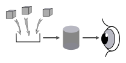
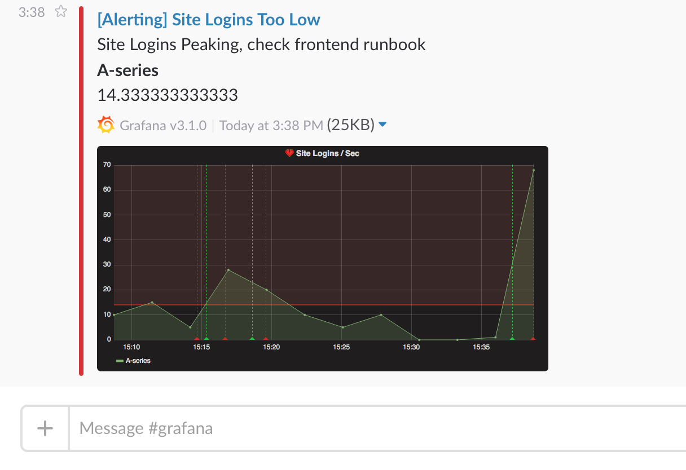
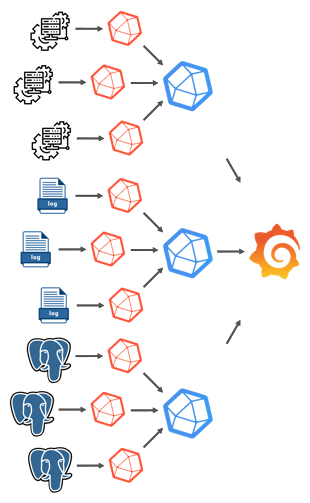

# La surveillance applicative avec Telegraf-InfluxDB-Grafana

## Objectifs

* Avoir une idée de l'état de santé du service rendu;
* Notifier en cas d'incidents applicatifs;
* Faciliter les analyses en situation de pannes applicatives.

*Contraintes :*

* Faible coût;
* Facile à maintenir;
* Evolutif;
* Pas uniquement orienté infrastructure (réseau, espace disque, saturation CPU/RAM, ...).

## Autres solutions

*Au lieu du DIY :* Grafana Cloud (https://grafana.com/products/cloud/). Coût raisonnable, mais les données sortent de l'entreprise (=> AWS). De plus, l'offre propose une solution basée sur Grafana-Prometheus-Loki; mais reste compatible avec Telegraf.

*Concurence directe :*

* ELK : Elasticsearch, Logstash, et Kibana (https://www.elastic.co/fr/what-is/elk-stack) : moins ouvert que TIG;
* Splunk : coûte, mais puissant.

*APM (Application Performance Management) :*

* Dynatrace (https://www.dynatrace.com/);
* AppDynamics (https://www.appdynamics.com/);
* Pinpoint (https://github.com/pinpoint-apm/pinpoint).

*/!\ Attention /!\ :*

* Lieu de stockage des données;
* RGPD.

## Principes

. Collecte de données;
. Persistance des données;
. Visualisation des données.

## Collecte : Agents Telegraf

* Metriques systèmes;
* Métriques de bases de données;
* Logs;
* ...
* Etendable par plugins (en GoLang).

*Installation :*

* Agent ou Service Windows;
* Package Linux;
* Image Docker;
* ...

## Persistance : InfluxDB

image::../assets/img/png/influxdb_logo.png[InfluxDB]

* Système de gestion de base de données orientée séries temporelles hautes performances (> 100 000 points de données par secondes);
* Mise à l'échelle horizontale;
* Collecte de données en push ou pull;
* Politique de rétention des données (aggrégation / suppression). Par défaut fixé à l'infini avec des échardes d'une semaine.

## Visualisation : Grafana

image::../assets/img/png/grafana_logo.png[Grafana]

Hautement personnalisable :

* Sources de données;
* Panneaux;
* Tableaux de bord.

### Sources de données

* Séries temporelles;
* Base de données relationnelles :
** MySQL;
** Oracle;
** PostgreSQL;
** SQL Server;
** ...
* Elasticsearch;
* Splunk;
* PRTG;
* ...

### Panneaux

image::../assets/img/png/grafana_panel_visualization.png[Visualisation des panneaux]

* Courbes;
* Histogrammes;
* Camemberts;
* Cadrans;
* Tableaux;
* Cartes thermiques;
* Textes;
* IFrames;
* ...
* Etendable (en TypeScript).

### Tableaux de bord

image::../assets/img/png/grafana_dashboard.png[Tableaux de bord]

https://grafana.com/grafana/dashboards[Catalog de tableaux de bord]

L'historique est assuré par Git.

*Tableaux de bord utilisés :*

* Telegraf System Overview : https://grafana.com/grafana/dashboards/914
* Nginx : https://grafana.com/grafana/dashboards/5063

### Alertes

* Emails;
* Webhooks;
* Messageries instantanées :
** Teams;
** Slack;
** Telegram;
** Discord;
** ...
* Kafka;
* ...

### Playlists

Affiche successivement les tableaux de la liste.

## Architectures

### Simple

image::../assets/img/svg/simple_architecture.svg[Architecture simple]

*Avantage :* Mise en place et administration simple.

### Orientée par type de source des données

*Avantage :* Homogénéité des données collectées. Cloisonnement des types de métriques collectées par Telegraf (il peut arriver d'avoir des informations en doublon car plusieurs agents Telegraf pour différentes sources collectent les mêmes types de métriques (CPU% et cpu) (mais peuvent être décorrelées)).

### Orchestrateur Docker

Pour des cas plus complexes :

* Kubernetes;
* AKS;
* ...

## Demo time :)

## Compléments :

* Authentification (nécessite un serveur SMTP) :
** Base interne;
** LDAP;
** Systèmes tiers :
*** Google;
*** Facebook;
*** GitLab;
*** Bitbucket;
*** ...
* Sécurité : Cloisonnement par équipes (possible de gérer par groupes AD). Il est recommandé par Grafana que (sauf cas exceptionnel de données sensibles) les tableaux de bord soient visibles à tous afin que les équipes puissent s'inspirer des créations des autres.
* Cycle de vie d'un tableau de bord : suite à un incident, si on se rend compte que le tableau de bord n'a pas permis de rapidement identifier la source de la panne, il faudra analyser les solution qui permettraient de compléter le tableau en cas de récurrence de cet incident.
* Mettre en place une stratégie de nommage des tableaux de bord (par exemple : TEST ou TMP pour les versions en cours de conception).
