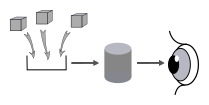
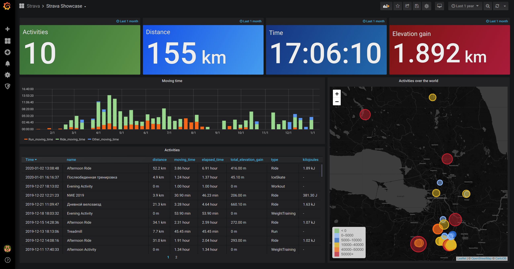
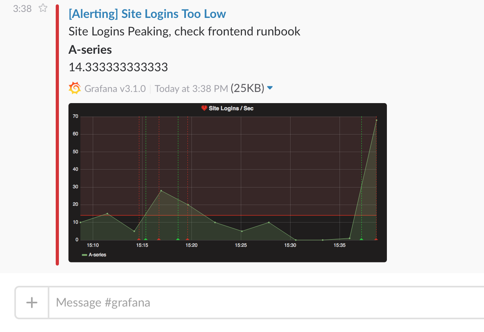
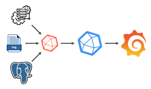
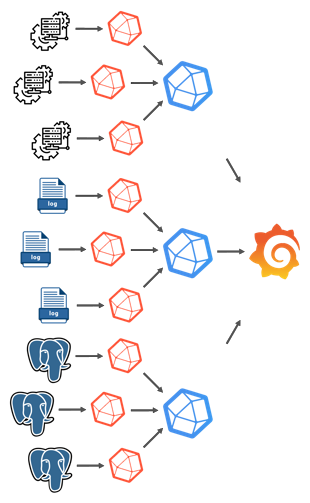

# La surveillance applicative avec Telegraf-InfluxDB-Grafana

## Objectifs

* Avoir une idée de l'état de santé du service rendu;
* Notifier en cas d'incidents applicatifs;
* Faciliter les analyses en situation de pannes applicatives.

## Principes

. Collecte de données;
. Persistance des données;
. Visualisation des données.

## Collecte : Agents Telegraf

* Metriques systèmes;
* Métriques de bases de données;
* Logs;
* ...
* Etendable par plugins.

## Persistance : InfluxDB

image::./assets/img/png/influxdb_logo.png[InfluxDB]

* Système de gestion de base de données orientée séries temporelles hautes performances (> 100 000 points de données par secondes);
* Mise à l'échelle horizontale;
* Collecte de données en push ou pull;
* Politique de rétention des données (aggrégation / suppression). Par défaut fixé à l'infini avec des échardes d'une semaine.

## Visualisation : Grafana

image::./assets/img/png/grafana_logo.png[Grafana]

Hautement personnalisable :

* Sources de données;
* Panneaux;
* Tableaux de bords.

### Sources de données

* Séries temporelles;
* Base de données relationnelles :
** MySQL;
** Oracle;
** PostgreSQL;
** SQL Server;
** ...
* Elasticsearch;
* PRTG;
* Splunk;
* ...

### Panneaux

image::./assets/img/png/grafana_panel_visualization.png[Visualisation des panneaux]

* Courbes;
* Histogrammes;
* Camemberts;
* Cadrans;
* Tableaux;
* Cartes thermiques;
* Textes;
* IFrames;
* ...

### Tableaux de bords

https://grafana.com/grafana/dashboards[Catalog de tableaux de bords]

### Alertes

* Emails;
* Webhooks;
* Messageries instantanées :
** Teams;
** Slack;
** Telegram;
** Discord;
** ...
* Kafka;
* ...

## Architectures

### Simple

*Avantage :* Mise en place et administration simple.

### Orientée par type de source des données

*Avantage :* Homogénéité des données collectées. Cloisonnement des types de métriques collectées par Telegraf (il peut arriver d'avoir des informations en doublon car plusieurs agents Telegraf pour différentes sources collectent les mêmes métriques (CPU% et cpu)).

## Demo time :)

