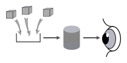
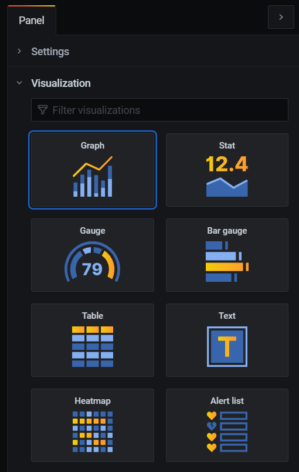
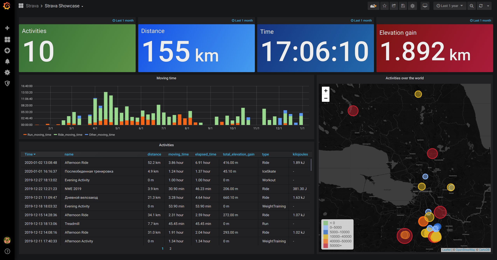

# La surveillance applicative avec Telegraf-InfluxDB-Grafana

## Objectifs

* Avoir une idée de l'état de santé du service rendu;
* Notifier en cas d'incidents applicatifs;
* Faciliter les analyses en situation de pannes applicatives.

## Principes

. Collecte de données;
. Persistance des données;
. Visualisation des données.

## Collecte : Agents Telegraf

* Metriques systèmes;
* Métriques de bases de données;
* Logs;
* ...
* Etendable par plugins.

## Persistance : InfluxDB

image::./assets/img/influxdb.png[InfluxDB]

* Système de gestion de base de données orientée séries temporelles hautes performances;
* Mise à l'échelle horizontale;
* Collecte de données en push ou pull.

## Visualisation : Grafana

image::./assets/img/grafana.png[Grafana]

Hautement personnalisable :

* Sources de données;
* Panneaux;
* Tableaux de bords.

### Sources de données

* Séries temporelles;
* Base de données relationnelles (MySQL, Oracle, PostgreSQL, SQL Server, ...);
* Elasticsearch;
* PRTG;
* ...

### Panneaux

* Courbes;
* Histogrammes;
* Camemberts;
* Cadrans;
* Tableaux;
* Cartes thermiques;
* Textes;
* IFrames;
* ...

### Tableaux de bords

## Demo time :)
